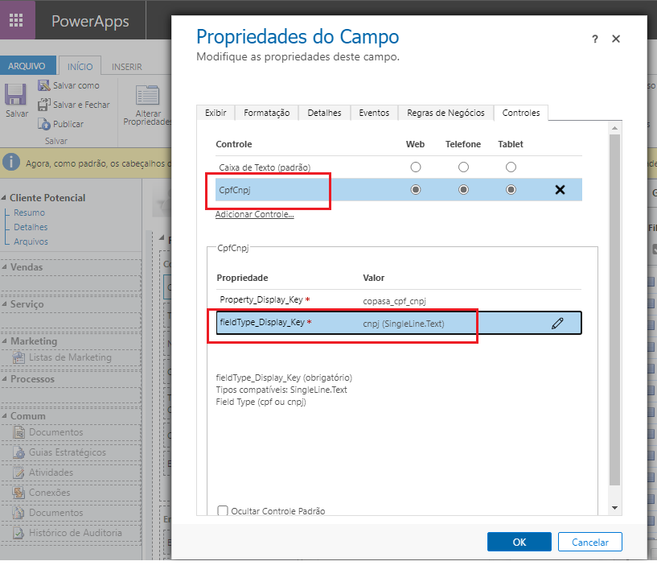

# PCF - CPF / CNPJ
PowerApps Component Framework for Dynamics 365

This component was created to assist in the identification of individuals and legal entities in Brazil. It formats and validates the document number at the time of typing.

 
 
 
 
 
